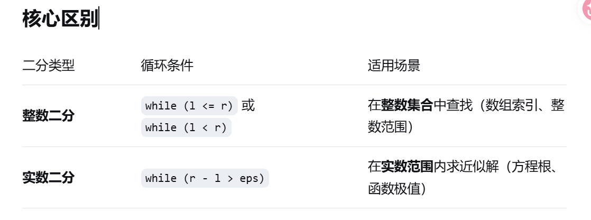

# 二分问题
## while(r>=l)还是while(r-l>1e-7)?
- 
- 当然这里只是举个例子，具体情况具体分析 
## 整数二分：在有序数组中查找元素，答案是整数
- 经典二分查找
- while(l<=r) while(l<r)
```cpp
int l=0,r=n-1;
while(l<=r){
    int mid=(l+r)/2;
    if(arr[mid]==target) return mid;
    else if(arr[mid]<target) l=mid+1;
    else r=mid-1;
}
return -1;
```
反正情况是很多的，灵神大佬有视频讲过
## 实数二分 while(r-l>eps) 求方程的根，求函数的极值点，以及任何需要实数且无法精确表示的问题，精度足够就停止
- 一元三次方程求解
```cpp
while(r-l>1e-7){
    double mid=(l+r)/2;
    if(f(mid)*f(r)<0) l=mmid;//根在[mid,r]
    else r=mid; //根在[l,mid]
    
}
```
```cpp
//不要混用该转换为double就要转为doule ,一定一定要注意格式
        double l=i,r=i+1;
        double f1=f(l);
        double f2=f(r);
%.02d输出两位整数，不足补0，常写为%02d
%。02f小数点后保留两位
```
## A-B问题
前提：有序序列，从小到大
lower_bound(begin,end,val) 找到第一个>=val的位置，返回第一个不小于val的元素的位置
upper_bound(begin,end,val) 找到第一个>val的位置，返回第一个大于val的元素的位置

## MOD的使用
-- 爆long long ，相乘数增加速度快，但是容易溢出，所以要用%取模，防止溢出
-- 给谁用MOD？会变大的变量都要进行取模

## 前缀和
```cpp
#include<bits/stdc++.h>
using namespace std;
int main(){
    int n,m;
    long long k;
    cin>>n>>m>>k;
    vector<vector<int>>a(n,vector<int>(m));
    for(int i=0;i<n;i++){
        for(int j=0;j<m;j++){
            cin>>a[i][j];
        }
    }

    long long ans=0;
    vector<long long >sum(m);

    for(int top=0;top<n;top++){
        fill(sum.begin(), sum.end(), 0); // 每个 top 初始化列和为0

        for(int bottom=top;bottom<n;bottom++){
            // 更新列和
            for(int j=0;j<m;j++){
                sum[j] += a[bottom][j];
            }

            // 双指针统计连续子数组和 <= k
            long long curr = 0;
            int left = 0;
            for(int right=0; right<m; right++){
                curr += sum[right];
                while(curr > k){
                    curr -= sum[left];
                    left++;
                }
                ans += right - left + 1; // 当前以 right 结尾的合法区间个数
            }
        }
    }

    cout<<ans<<endl;
    return 0;
}
```
## 状态DP
f[i] 铺满前i列，且第i列是完整的方案数
g[i] 铺满前i列，且第i列的上方格子是空的，下方各自被覆盖的方案数

初始状态 f[0]=1 空画布，0列铺满，1种方案
        f[1]=1 只有一列，只能放一个竖i型
        g[0]=0 不可能
        g[1]=0
转移方程推导
如何得到f[i]
情况A：前i列已经完整，从f[i-1]转移
